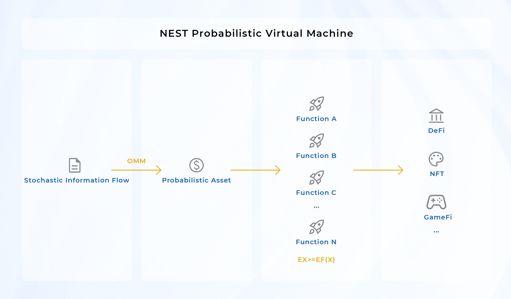

# What is NEST?

NEST creatively introduces random information flow with a decentralized oracle and tokenizes random information flow through the OMM mecha- nism, generating many stochastic assets. The NEST probabilistic virtual machine PVM, based on basic functions, can program stochastic assets, which applies to a large number of real-world scenarios. An inherent cost mechanism ensures the system supply converges, resulting in a new univer- sal coin with an innate price appreciation logic. The NEST coin provides a whole new development tool and is a creative new asset for the blockchain world.

## What problem does NEST solve

Satoshi Nakamoto’s ground-breaking insights about blockchain have drawn our attention from traditional assets. Blockchain and Bitcoin strengthen the security and openness of information and data by employing the con- sensus mechanism, so that information such as balances will not be used for double-spending. The scarcity of information in the process of trans- mission and use is ensured, which is a crucial step for information to be converted into assets. Without any room for debate, the purest digital as- set is Bitcoin, which does not require a third party to confirm a transaction or prevent double-spending.

As a new concept of blockchain and encryption technology, Ethereum adheres to the ideologies of Satoshi Nakamoto and the transfer convenience of digital assets. It retains the information properties of digital assets, mak- ing it possible for programming, and this is the core value of the Ethereum virtual machine.

In the process of programming, the program calculated output number of assets will not increase (may reduce, destroyed, or locked, for example): If an address has x ETH, then x can be considered as a deterministic variable, which will become f(x) in EVM after calculation. If no other assets are involved, the calculation must conform to x ≥ F(x), which is the first constraint of the Ethereum virtual machine.

However, Ethereum also has a downside: all asset information is de- terministic (x is a deterministic variable). If we want x to be a random variable X, that is, the result of a random event determines the value of this variable X, it is uncertain before the occurrence of this random event, and we only have information about its distribution at most. In addition, X is introduced into programming and calculation to obtain this random variable’s functional value F(x). Note that F(X) itself is also a random variable, which is beyond the reach of the current EVM mechanism. For- tunately, in the oracle we introduced stochastic price information based on the OMM (omnipotent market maker) mechanism to generate tokens of which the return can represent random information flow. The number of it before a given time period is uncertain, but settlement of a certain number of tokens at certain blocks can be done according to the expected distribution figures. This is the tokenization process of random informa- tion; we name this token NEST coins. Therefore, a NEST coin is a unit of value for random data.

## Probabilistic Virtual Machine (PVM)

To achieve more applications involving random variables, after implementing the tokenization of random information, we can make functional transformations to these random variables; this process is to obtain random variables with different distributions. These distributions can be used in Defi, Gamefi, NFT, etc. Of course, including all transformation functions for practical purposes is unnecessary.

Still, we can consider using some standard essential functions as a set of bases on which the NEST function space is derived. For example, suppose the transformation keeps the expected value decreasing all the time, namely E(X)≥ E(F(X)), where E denotes the expected value, then like the EVM constraint. In that case, this is a system with decreasing expectations or a deflationary system. We name this system the Probabilistic Virtual Machine (PVM). 

With PVM, we are no longer subject to the initial value constraint of ETH: for ex- ample, in derivatives trading under the AMM mechanism, the seller LP cannot guarantee that the option can be settled at any price. This is an incomplete probability space, and PVM solves this problem.
